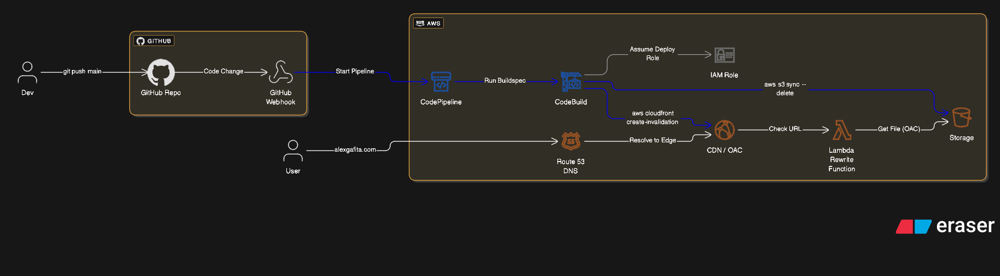

# System Design

## Overview
This portfolio is engineered as a **Cloud-Native Serverless** application, prioritizing performance, security, and zero-maintenance infrastructure. It leverages the AWS ecosystem to deliver static assets globally with low latency.

## Architecture Diagram

---

## Key Design Decisions

### 1. Infrastructure (AWS Serverless)
* **Route 53:** Manages DNS resolution for `alexgafita.com`.
* **CloudFront (CDN / OAC):** Serves as the global Content Delivery Network (CDN) to cache assets at the edge. Utilizes **Origin Access Control (OAC)** to ensure files are only accessible via CloudFront.
* **S3 Standard:** Acts as the origin storage for the static HTML/CSS/JS generated by Next.js.

### 2. Edge Logic
* **CloudFront Functions:** A lightweight JavaScript function intercepts viewer requests to handle **URL Rewriting** (e.g., mapping `/projects` to `/projects.html`).
* *Trade-off:* Chosen over Lambda@Edge to eliminate "Cold Starts" and ensure $<10\text{ms}$ latency for routing logic.

### 3. CI/CD Pipeline (Automated AWS Workflow)
* **CodePipeline (CP):** Acts as the **orchestration hub**. It is triggered by a **GitHub Webhook** on every `git push main`, managing the sequential execution of the deployment stages.
* **CodeBuild (CB):** The secure **execution environment**. It runs the `buildspec.yml` script to perform the deployment commands (`aws s3 sync` and `aws cloudfront create-invalidation`).
* **IAM Role:** The **security mechanism**. CodeBuild assumes a specialized IAM Role that grants *only* the specific permissions required (`s3:PutObject`, `cloudfront:CreateInvalidation`) to perform the deployment actions, upholding the **Principle of Least Privilege**.
* **Atomic Deploys:** The pipeline ensures the site is built, synchronized to S3, and the **CloudFront cache is instantaneously invalidated** in a single, atomic workflow, ensuring zero-downtime updates.